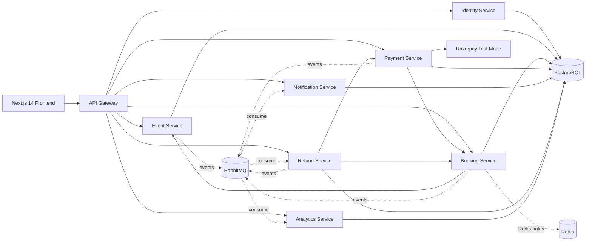

# 🚀 DevSummit

A modern microservices-based tech conference, workshop, and hackathon platform. Built with **FastAPI**, **Next.js 14**, **PostgreSQL**, **Redis**, **RabbitMQ**, and **Docker**.

---

## 🌟 Features

* **🗺️ Multi-Track Schedule Viewer**: Interactive multi-day timetable with dynamic track filtering (AI & Agents, Distributed Systems, Hands-on Labs) and expandable talk abstracts.
* **🎤 Keynote & Speaker Showcase**: Speaker profiles featuring company tags, biographies, talk schedules, and direct links to GitHub, LinkedIn, and Twitter/X.
* **📇 Printable Lanyard Badges (PDF)**: Real-time generation of 4"×6" venue badges with custom attendee designations, lanyard punch-hole slot, and gate check-in QR codes.
* **🔒 Zero-Overselling Concurrency**: Atomic Redis Lua scripts (`EVAL`) guarantee capacity holds so the system never oversells under high-concurrency traffic.
* **⚡ Event-Driven Decoupling**: Downstream services (notifications, email dispatch, analytics, automated refunds) communicate asynchronously via RabbitMQ topic exchanges.
* **🗄️ Database-per-Service**: 7 logically isolated PostgreSQL databases, each with its own independent Alembic migration history.

---

## 🏗️ Architecture



---

## 🛠️ Tech Stack

* **Frontend**: Next.js 14 (App Router), TypeScript, Tailwind CSS, Recharts
* **Backend**: Python 3, FastAPI, Pydantic v2, SQLAlchemy 2.0, Alembic
* **Messaging & Cache**: RabbitMQ (Topic Exchange), Redis (Atomic Lua holds)
* **Databases**: PostgreSQL (7 isolated databases)
* **Auth**: JWT (python-jose), Argon2 password hashing
* **Deployment**: Docker & Docker Compose

---

## 🚀 Quick Start

### Prerequisites
* [Docker Desktop](https://www.docker.com/products/docker-desktop/) installed and running.

### 1. Clone & Setup Environment
```bash
git clone https://github.com/<your-username>/devsummit.git
cd devsummit
cp .env.example .env
```

### 2. Launch with Docker Compose
```bash
docker compose up --build
```

### 3. Access the Application
* **Web App**: [http://localhost:3000](http://localhost:3000)
* **API Gateway**: [http://localhost:8080](http://localhost:8080)
* **RabbitMQ Dashboard**: [http://localhost:15672](http://localhost:15672) *(User: `guest`, Pass: `guest`)*

> **⚡ Quick Demo Seed**: Click the **"⚡ Seed Flagship DevSummit"** button on the homepage to instantly populate 3 tracks, 6 keynote speakers, and a multi-day schedule!

---

## 📂 Microservices Overview

| Service | Port | Database | Description |
|---|---|---|---|
| **api-gateway** | `8080` | — | Reverse proxy, rate limiting, and correlation IDs |
| **identity-service** | `8001` | `identity_db` | Authentication, JWT tokens, user profiles |
| **event-service** | `8002` | `event_db` | Conferences, tracks, speakers, sessions, schedules |
| **booking-service** | `8003` | `booking_db` | Ticket reservations, Redis atomic holds, TTL sweeper |
| **payment-service** | `8004` | `payment_db` | Payment gateway integration, signature verification |
| **notification-service** | `8005` | `notification_db` | In-app alerts and simulated email dispatch |
| **refund-service** | `8006` | `refund_db` | Automated refund processing and cancellation fan-out |
| **analytics-service** | `8007` | `analytics_db` | Real-time views, conversion rates, and revenue metrics |

---

## 📜 License
Distributed under the MIT License.
