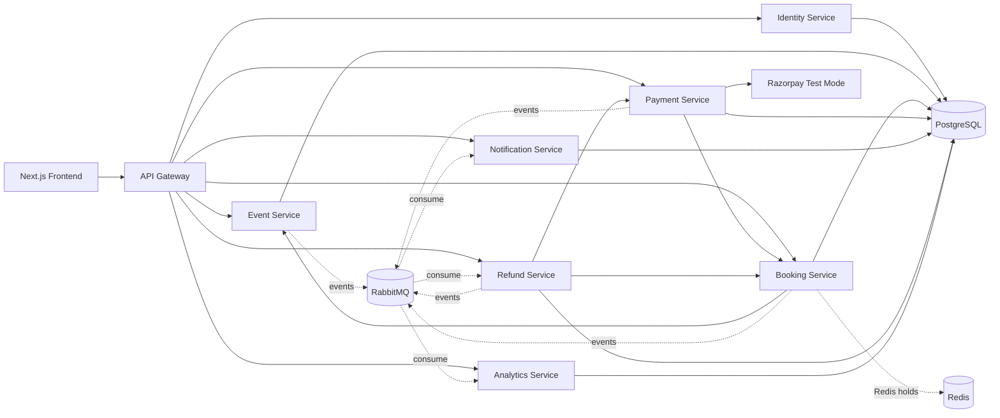

# EventSphere

A production-shaped event discovery, ticketing, payment, refund, notification, and analytics platform, built as independently-runnable microservices behind a single API Gateway.

## 1. Overview

EventSphere lets **organizers** create and publish events with multiple ticket types, **attendees** discover, reserve, and pay for tickets (Razorpay, Test Mode), and **admins** moderate the platform. Every write path is backed by real PostgreSQL state; RabbitMQ carries domain events between services for notifications and analytics; Redis enforces ticket-reservation concurrency so the system never oversells.

## 2. Architecture



Two kinds of inter-service calls, deliberately:

- **Synchronous HTTP** for anything the caller must know the result of *right now* (Booking Service asking Event Service "is this ticket still available", Payment Service telling Booking Service "confirm this booking").
- **Asynchronous events over RabbitMQ** for anything a downstream service should eventually react to but the caller shouldn't block on (Notification Service sending a confirmation email, Analytics Service updating a dashboard counter).

## 3. Service responsibilities

| Service | Owns | Exposes |
|---|---|---|
| **Identity** | users, roles, credentials | register/login/refresh, JWT issuance, profile |
| **Event** | events, venues, ticket types | CRUD, draft→publish→cancel state machine, search/filter, internal stock-adjustment API |
| **Booking** | bookings, booking items, Redis reservation holds | reserve/cancel, confirm (internal), reservation-expiry sweeper |
| **Payment** | payments | Razorpay order creation, signature verification, webhook, organizer revenue dashboard |
| **Notification** | notifications, simulated emails | RabbitMQ consumer → in-app + simulated email; list/mark-read API |
| **Refund** | refunds | RabbitMQ consumer (attendee cancellation + bulk event-cancellation refunds), manual trigger API |
| **Analytics** | per-event aggregate stats | RabbitMQ consumer, organizer/admin dashboards |
| **API Gateway** | nothing (stateless) | single public entrypoint, routing, correlation IDs, rate limiting |

## 4. Database architecture

One PostgreSQL **server** (one container), one **logical database per service** (`identity_db`, `event_db`, `booking_db`, `payment_db`, `notification_db`, `refund_db`, `analytics_db`), each with its own Alembic migration history. This gives genuine service-level data isolation — no service can query another's tables — at a fraction of the operational cost of seven separate database servers, which is the right tradeoff for a project at this scale. Cross-service reads/writes always go through the owning service's HTTP API, never direct SQL.

## 5. Booking lifecycle & concurrency

```
PENDING_PAYMENT --(payment verified)--> CONFIRMED --(attendee/organizer cancels)--> REFUND_PENDING --(Razorpay refund settles)--> REFUNDED
PENDING_PAYMENT --(attendee cancels before paying)--> CANCELLED
PENDING_PAYMENT --(10 min TTL elapses)--> EXPIRED
```

Overselling is prevented by an **atomic Redis Lua script** (`services/booking-service/app/redis_holds.py`): reserving N tickets reads the currently-held quantity for that ticket type and compares it against real capacity from Event Service, all inside one indivisible `EVAL`. Two concurrent requests for the last ticket cannot both observe capacity as free — this is verified by an actual multi-threaded test hitting a real Redis instance (`test_last_ticket_concurrent_reservation_never_oversells`), not a mock.

Inventory is only **permanently** decremented in Postgres after a verified payment (Booking Service → Event Service `/internal/ticket-types/{id}/decrement`, idempotent by booking+item id). A background sweeper (`app/sweeper.py`) marks reservations `EXPIRED` and releases their Redis hold once the 10-minute TTL passes.

## 6. Payment lifecycle (Razorpay, Test Mode)

```
Attendee reserves tickets
  → POST /payments/order            (Payment Service creates a Razorpay order)
  → Razorpay Standard Checkout opens in the browser
  → attendee pays with a test card
  → POST /payments/verify           (server-side HMAC-SHA256 signature check)
  → Booking Service /internal/bookings/{id}/confirm
  → PaymentSucceeded event on RabbitMQ → Notification + Analytics
```

The Razorpay **secret key never reaches the browser** — only `razorpay_key_id` and `order_id` are returned by `/payments/order`. A webhook endpoint (`/payments/webhook`) provides defense-in-depth for cases where the browser callback never fires. Every verify/webhook path is idempotent: replaying a signature or webhook event is a safe no-op.

### Setting up Razorpay Test Mode
1. Create a free account at https://dashboard.razorpay.com/signup
2. Toggle **Test Mode** (top-left switch in the dashboard)
3. **Settings → API Keys → Generate Test Key** → copy the Key Id / Key Secret into your `.env`
4. *(optional, for webhook coverage)* **Settings → Webhooks → Add Webhook**, point it at `<public-url>/api/payments/webhook`, subscribe to `payment.captured` and `payment.failed`, copy the generated secret into `RAZORPAY_WEBHOOK_SECRET`
5. Test checkout with card `4111 1111 1111 1111`, any future expiry, any CVV, any OTP

## 7. Refund lifecycle

```
Attendee cancels a CONFIRMED booking
  → Booking Service sets REFUND_PENDING, publishes RefundRequested
  → Refund Service consumes it, calls Payment Service to issue a real
    Razorpay TEST MODE refund, records the Refund row, tells Booking
    Service to mark REFUNDED, publishes RefundProcessed
  → Notification Service sends the attendee a refund confirmation
```

Organizer-initiated **event cancellation** fans out the same way: `EventCancelled` → Refund Service looks up every `CONFIRMED` booking for that event and refunds each one, individually idempotent.

## 8. RabbitMQ event contracts

Single topic exchange `eventsphere.events`; each service declares its own durable queue bound to the routing keys it cares about, plus a `.dlq` dead-letter queue for messages that fail processing. Envelope (`shared/common/eventsphere_common/events.py`):

```json
{
  "event_id": "uuid",
  "event_type": "BookingConfirmed",
  "occurred_at": "2026-01-01T12:00:00Z",
  "source_service": "booking-service",
  "data": { "booking_id": "...", "user_id": "...", "amount": 499.0 }
}
```

Consumers are idempotent via a `processed_events(event_id)` ledger table — at-least-once delivery never produces duplicate notifications, refunds, or analytics counts (all covered by tests using a real local RabbitMQ broker).

## 9. Technology stack

Frontend: Next.js 14 (App Router) · TypeScript · Tailwind CSS · Recharts
Backend: Python · FastAPI · SQLAlchemy 2.0 · Alembic · PostgreSQL · JWT (python-jose) · Argon2
Infra: Docker Compose · RabbitMQ · Redis
Payments: Razorpay Standard Checkout (Test Mode)
Testing: Pytest · HTTPX · FastAPI TestClient

## 10. Repository structure

```
event-sphere/
├── frontend/                  Next.js app (all attendee/organizer/admin pages)
├── services/
│   ├── identity-service/
│   ├── event-service/
│   ├── booking-service/
│   ├── payment-service/
│   ├── notification-service/
│   ├── analytics-service/
│   └── refund-service/        each: app/, alembic/, tests/, Dockerfile, requirements.txt
├── api-gateway/                routing, correlation IDs, rate limiting
├── shared/common/               eventsphere_common: JWT auth, RabbitMQ bus, DB session helpers
├── infrastructure/postgres/     per-service database bootstrap script
├── docker-compose.yml
├── .env.example
└── README.md (this file)
```

## 11. Local setup

```bash
git clone <this-repo>
cd event-sphere
cp .env.example .env
# edit .env: set JWT_SECRET, RAZORPAY_KEY_ID, RAZORPAY_KEY_SECRET (see section 6)
docker compose up --build
```

Once healthy:
- Frontend: http://localhost:3000
- API Gateway: http://localhost:8080 (all traffic goes through `/api/*`)
- RabbitMQ management UI: http://localhost:15672 (user/pass from `.env`)
- Individual services are also reachable directly on 8001–8007 for debugging.

First run automatically creates all 7 databases and runs Alembic migrations for every service (each service's container runs `alembic upgrade head` before starting `uvicorn`).

## 12. Testing

Every service ships its own test suite (`services/<name>/tests/`), runnable independently:

```bash
cd services/booking-service
pip install -r requirements.txt
pytest
```

Notably, `booking-service`, `notification-service`, `refund-service`, and `analytics-service` include tests that exercise **real local Redis and/or RabbitMQ** (not mocks) — including a genuine multi-threaded test proving the system cannot oversell the last remaining ticket under concurrent load.

## 13. Deployment (AWS)

Recommended shape once local Docker Compose is verified working end-to-end:

- Each service's Dockerfile builds as-is for **ECS Fargate** (or any container platform) — no code changes needed.
- **RDS PostgreSQL** replaces the `postgres` container; keep the one-server/seven-database layout, or split into separate instances later if a service's load genuinely warrants it.
- **ElastiCache for Redis** replaces the `redis` container.
- **Amazon MQ (RabbitMQ engine)** replaces the `rabbitmq` container, or self-host RabbitMQ on a small EC2/Fargate task.
- API Gateway and frontend go behind an **Application Load Balancer** with an ACM certificate for HTTPS; the frontend's `NEXT_PUBLIC_API_BASE_URL` points at the ALB's public HTTPS URL for the gateway.
- All secrets (`JWT_SECRET`, `RAZORPAY_KEY_SECRET`, DB credentials) move into **AWS Secrets Manager**, injected as environment variables at task-definition time — never baked into images.
- Migration order on deploy: `postgres`/`redis`/`rabbitmq` first → run each service's `alembic upgrade head` (already the container's entrypoint) → identity → event → booking → payment → notification/refund/analytics → api-gateway → frontend.
- Build command per service: `docker build -f services/<name>/Dockerfile -t <ecr-repo>:<tag> .` (build context is the repo root — see each Dockerfile's header comment).

## 14. Future: Sentinel

EventSphere is intentionally built without observability infrastructure (no Prometheus/Grafana/OpenTelemetry) so that a future companion project, **Sentinel**, can be layered on top to monitor it. Every service already emits structured logs with `x-correlation-id` propagated end-to-end through the API Gateway and between services, so distributed tracing can be added later without re-instrumenting request handling from scratch.
