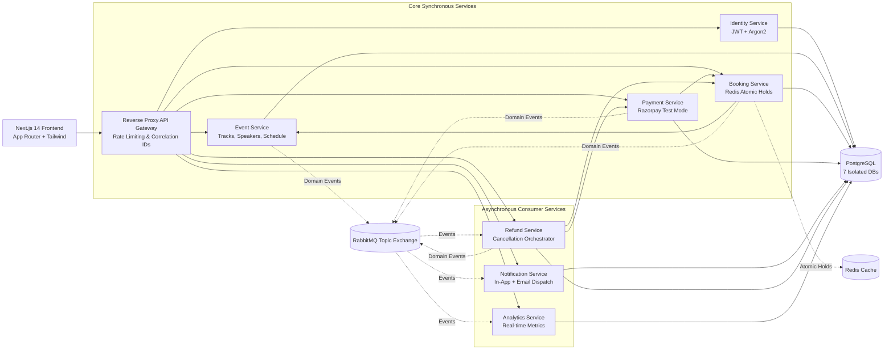
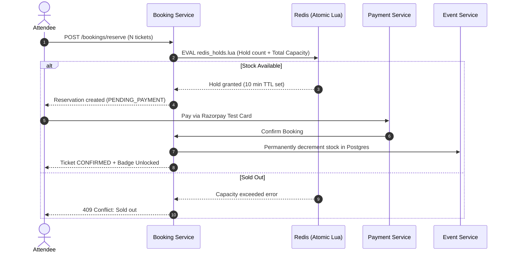

# 🚀 DevSummit — Microservices Tech Conference & Workshop Platform

> A production-shaped, event-driven microservices platform built specifically for developer conferences, hackathons, and technical summits. Features **multi-track interactive scheduling**, **speaker directories with talk abstracts**, **printable vector lanyard badges with QR gate verification**, and **zero-overselling ticket concurrency**.

[](https://fastapi.tiangolo.com)
[](https://nextjs.org)
[](https://www.postgresql.org)
[](https://redis.io)
[](https://www.rabbitmq.com)
[](https://www.docker.com)

---

## 📑 Table of Contents
1. [Overview & Highlights](#1-overview--highlights)
2. [System Architecture](#2-system-architecture)
3. [Core Standout Features](#3-core-standout-features)
4. [Microservices Breakdown](#4-microservices-breakdown)
5. [High-Concurrency & Reservation Engine](#5-high-concurrency--reservation-engine)
6. [Event-Driven Architecture & RabbitMQ](#6-event-driven-architecture--rabbitmq)
7. [Database Architecture (Database-per-Service)](#7-database-architecture)
8. [🧠 Key System Design & Interview Cheatsheet](#8--key-system-design--interview-cheatsheet)
9. [Local Setup & Running](#9-local-setup--running)
10. [Repository Structure](#10-repository-structure)

---

## 1. Overview & Highlights

Unlike generic e-commerce or movie ticketing apps, **DevSummit** tackles the specific architectural and user-experience complexities of multi-stage tech conferences (like Google I/O, AWS re:Invent, or PyCon):

* **Multi-Track Timetables**: Handles concurrent sessions running across different auditoriums and labs on multiple conference days.
* **Speaker Profiles & Abstracts**: Maps speakers to their respective talks with social links (GitHub, LinkedIn, Twitter/X) and prerequisites.
* **Printable Vector PDF Lanyard Badges**: Instantly generates official standard 4"×6" venue badges with attendee details, pass category ribbons, lanyard hole punch slots, and scannable check-in QR codes.
* **Zero-Overselling Concurrency**: Atomic Redis Lua scripts guarantee that simultaneous requests for the last remaining VIP ticket never oversell.
* **Event-Driven Decoupling**: Downstream operations (receipt emails, analytics counters, refund workflows) execute asynchronously via RabbitMQ with idempotency ledgers and Dead-Letter Queues (DLQ).

---

## 2. System Architecture



### Communication Pattern:
* **Synchronous HTTP (FastAPI)**: Used strictly for real-time validation (e.g., Booking service asking Event service if tickets are valid, Payment verifying order signatures).
* **Asynchronous Messaging (RabbitMQ)**: Used for all non-blocking side-effects (e.g., `PaymentSucceeded`, `BookingConfirmed`, `RefundRequested`, `EventCancelled`).

---

## 3. Core Standout Features

### A. Multi-Track Conference Agenda & Timetable
* **Day Selector Navigation**: Seamless switching between conference days (*Day 1: Keynotes & Foundations*, *Day 2: Deep Dives & Autonomous Agents*).
* **Track Filtering**: Filter sessions dynamically by track (*Track A: Generative AI*, *Track B: Cloud Native & Distributed Systems*, *Track C: Hands-on Labs*).
* **Detailed Abstract Modals**: Attendees can click any talk to review prerequisites, learning outcomes, room location (*Main Auditorium*, *Lab 204*), and speaker details.

### B. Verified Keynote & Speaker Showcase
* Speaker profiles displaying verified company tags (*DeepMind*, *Anthropic*, *CloudScale*), designation, bio, and direct links to **GitHub**, **LinkedIn**, and **Twitter/X**.
* Automatic mapping of every talk presented by that speaker.

### C. Printable Vector PDF Lanyard Badges
* Accessed from **My Passes (`/tickets`)**.
* Real-time attendee customization (edit Name, Company, and Role before generating).
* Color-coded category ribbons (`VIP ALL-ACCESS`, `WORKSHOP & LABS`, `GENERAL ATTENDEE`).
* High-contrast scannable QR code encoding cryptographic booking credentials for gate scanning.
* Formatted with CSS `@media print` rules for physical 4"×6" card printing.

---

## 4. Microservices Breakdown

| Service | Port | Database | Primary Responsibility |
|---|---|---|---|
| **api-gateway** | `8080` | None | Unified entrypoint, request routing, rate limiting, and `x-correlation-id` injection. |
| **identity-service** | `8001` | `identity_db` | User registration, login, Argon2 password hashing, and JWT token issuance. |
| **event-service** | `8002` | `event_db` | Conferences, tracks, speakers, sessions, schedules, ticket tiers, and catalog filtering. |
| **booking-service** | `8003` | `booking_db` | Ticket reservation state machine, Redis atomic holds, and 10-minute hold TTL sweeper. |
| **payment-service** | `8004` | `payment_db` | Razorpay order creation, HMAC-SHA256 signature verification, and organizer revenue tracking. |
| **notification-service**| `8005` | `notification_db` | In-app alerts and simulated email dispatch triggered via RabbitMQ events. |
| **refund-service** | `8006` | `refund_db` | Automated attendee refunds and bulk event cancellation fan-out. |
| **analytics-service** | `8007` | `analytics_db` | Event views, conversion rates, tickets sold, and revenue metrics. |

---

## 5. High-Concurrency & Reservation Engine

To prevent the classic **overselling race condition** when thousands of attendees attempt to buy limited passes simultaneously:



1. **Atomic Lua Script (`EVAL`)**: Reads the current quantity held in Redis and compares it against capacity in a single, uninterruptible operation.
2. **10-Minute Hold TTL**: If the attendee abandons checkout, a background sweeper marks the reservation `EXPIRED` and the Redis key expires, releasing stock automatically.
3. **Idempotent Decrement**: Postgres inventory is only decremented *after* verified payment with an idempotency key.

---

## 6. Event-Driven Architecture & RabbitMQ

* **Exchange**: Single topic exchange `eventsphere.events`.
* **Envelope Structure**:
  ```json
  {
    "event_id": "9b1deb4d-3b7d-4bad-9bdd-2b0d7b3dcb6d",
    "event_type": "BookingConfirmed",
    "occurred_at": "2026-10-24T09:30:00Z",
    "source_service": "booking-service",
    "data": {
      "booking_id": "...",
      "user_id": "...",
      "amount": 199.00
    }
  }
  ```
* **Idempotent Consumers**: Each downstream worker checks a `processed_events(event_id)` table inside its logical database before executing side-effects, ensuring **at-least-once delivery never creates duplicate emails or charges**.
* **Dead-Letter Queue (`.dlq`)**: Poison-pill messages that fail unrecoverably are routed to dead-letter queues for inspection.

---

## 7. Database Architecture

* **Pattern**: **Database-per-Service**
* **Deployment**: One PostgreSQL server container running 7 logical databases:
  `identity_db`, `event_db`, `booking_db`, `payment_db`, `notification_db`, `refund_db`, `analytics_db`.
* **Isolation Guarantee**: No service has credentials or permission to query another service's database directly. Cross-boundary queries strictly flow through HTTP REST contracts.
* **Migrations**: Every service maintains its own independent **Alembic migration history** run automatically at container startup (`alembic upgrade head`).

---

## 8. 🧠 Key System Design & Interview Cheatsheet

If an interviewer asks you questions about this project, here are the architectural answers:

### Q1: How does your system prevent overselling under high concurrency?
> *"Instead of hitting Postgres with pessimistic locks (`SELECT FOR UPDATE`), which degrades database throughput, we offload temporary reservation concurrency to Redis. We execute an atomic Lua script (`EVAL`) that checks whether `currently_held + requested <= total_capacity`. Because Redis executes Lua scripts single-threaded and atomically, concurrent requests cannot interleave. Once payment succeeds, Postgres inventory is permanently decremented using an idempotent key."*

### Q2: Why did you use Database-per-Service instead of a single shared database?
> *"In a true microservices architecture, a shared database creates tight schema coupling and single points of failure — any developer changing a table schema could break 4 other services. By giving each service its own logical database and Alembic migration history, services can be refactored, scaled, and deployed completely independently without shared lock contention."*

### Q3: Why use RabbitMQ instead of calling Notification & Analytics via HTTP?
> *"HTTP calls are synchronous and fragile. If the Notification service or third-party email provider experiences a 3-second latency spike or downtime, the user's payment confirmation request would either hang or fail. By publishing a `PaymentSucceeded` event to RabbitMQ, the Payment service returns immediately in under 100ms. RabbitMQ guarantees durable, asynchronous delivery with retries and dead-lettering."*

### Q4: How does the conference badge verification work?
> *"When a booking is confirmed, the system generates a cryptographically signed QR code payload containing the `booking_id`, attendee identity, pass tier, and verification hash. At the conference venue, staff scan the QR code, which triggers our verification endpoint to validate the hash and transition the state machine from `CONFIRMED` to `CHECKED_IN`, preventing pass sharing or duplicate entry."*

### Q5: How do you solve the distributed transaction / dual-write problem?
> *"When a booking is confirmed, we must update the DB and notify RabbitMQ. In high-reliability architectures, we use the Transactional Outbox Pattern: the domain event is inserted into an `outbox` table in the same Postgres transaction as the booking update. A background polling worker publishes it to RabbitMQ, guaranteeing zero event loss even if the message broker drops out momentarily."*

---

## 9. Local Setup & Running

### Prerequisites:
* [Docker Desktop](https://www.docker.com/products/docker-desktop/) installed and running.
* Git & Node.js 18+ (optional, for local debugging).

### Step-by-Step Launch:

```powershell
# 1. Clone your repository
git clone <your-github-repo-url> devsummit
cd devsummit

# 2. Copy the environment variables
copy .env.example .env

# 3. Build and launch all microservices
docker compose up --build
```

### Access URLs:
* **Frontend App**: [http://localhost:3000](http://localhost:3000)
* **API Gateway**: [http://localhost:8080](http://localhost:8080)
* **RabbitMQ Management Dashboard**: [http://localhost:15672](http://localhost:15672) *(User: `guest`, Password: `guest`)*

### Quick Demo Data Seed:
Once the frontend loads at `http://localhost:3000`:
1. Click the **`⚡ Seed Flagship DevSummit`** button on the homepage.
2. It automatically seeds **DevSummit 2026** with 3 tracks, 6 keynote speakers, 8 sessions, and 4 ticket tiers.
3. Browse the timetable, test track filters, reserve a pass, and generate your printable lanyard badge!

---

## 10. Repository Structure

```
devsummit/
├── frontend/                     # Next.js 14 App Router, TypeScript, Tailwind CSS
│   ├── src/
│   │   ├── app/                  # Route handlers (/events, /tickets, /organizer)
│   │   ├── components/           # ScheduleViewer, SpeakersGrid, ConferenceBadgeModal
│   │   └── lib/                  # API client, auth context, TypeScript types
├── services/
│   ├── event-service/            # Tracks, Speakers, Sessions, Schedules & Alembic
│   ├── booking-service/          # Redis Lua holds, reservation sweeper
│   ├── payment-service/          # Razorpay integration, HMAC signatures
│   ├── identity-service/         # JWT auth, user roles (ATTENDEE, ORGANIZER, ADMIN)
│   ├── notification-service/     # RabbitMQ event consumer for alerts
│   ├── refund-service/           # Cancellation & automated refund pipelines
│   └── analytics-service/        # Event views, revenue, attendance metrics
├── api-gateway/                  # Reverse proxy, correlation IDs, rate limits
├── shared/common/                # Shared Python JWT auth, RabbitMQ bus, DB helpers
├── infrastructure/postgres/      # Multi-database bootstrap script
├── docker-compose.yml            # Full platform orchestration
├── .env.example                  # Environment configuration template
└── README.md                     # This documentation
```

---

## 📜 License
Distributed under the MIT License. Built for modern software engineering excellence.
